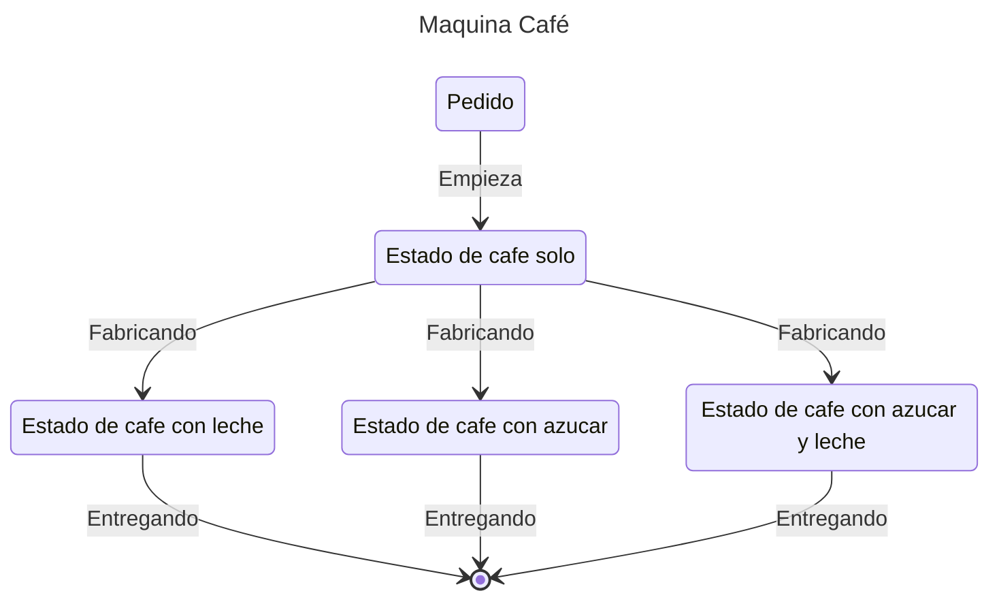

```mermaid
---
title: Maquina Café
---
stateDiagram
    State "Estado de cafe con leche" as State2
    State "Estado de cafe con azucar" as State3
    State "Estado de cafe solo" as State1
    State "Estado de cafe con azucar y leche" as State4
    State "Pedido" as [*]
    
[*]-->State1:Empieza

State1 --> State2:Fabricando

State1 --> State3:Fabricando

State1 --> State4:Fabricando

State2-->[*]:Entregando

State3-->[*]:Entregando

State4-->[*]:Entregando


```