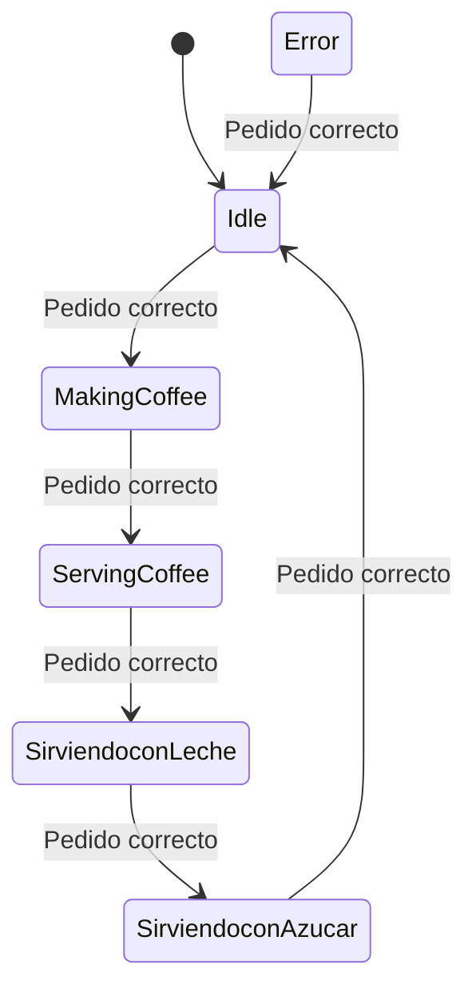

```mermaid

stateDiagram-v2
    [*] --> Idle
    Idle --> MakingCoffee: Pedido correcto
    MakingCoffee --> ServingCoffee: Pedido correcto
    ServingCoffee --> SirviendoconLeche: Pedido correcto
    SirviendoconLeche --> SirviendoconAzucar: Pedido correcto
    SirviendoconAzucar --> Idle: Pedido correcto
    Error --> Idle: Pedido correcto

```